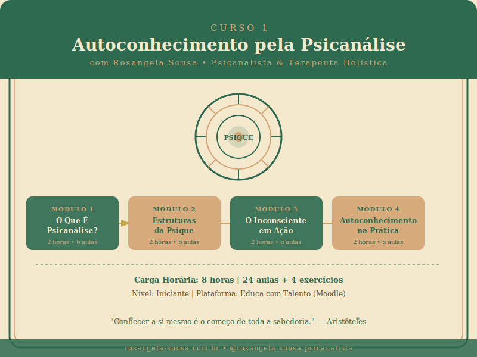
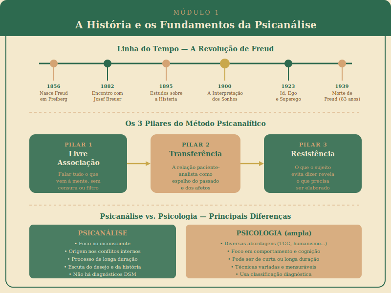
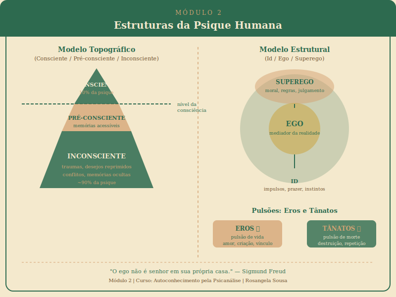
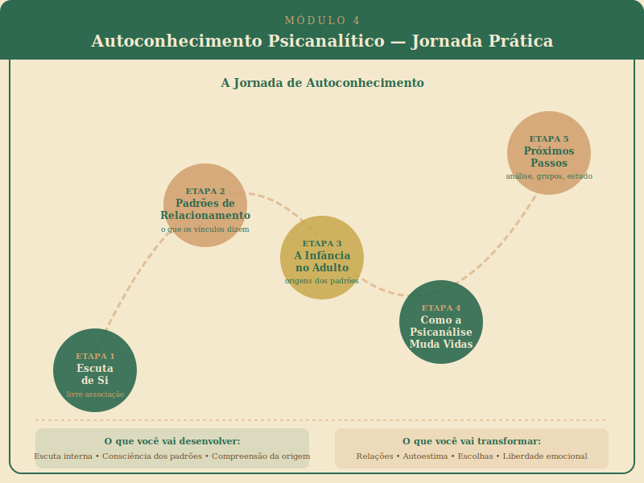

# Autoconhecimento pela Psicanálise

> **Curso 1 | Educa com Talento — Moodle | Rosangela Sousa**
> Psicanalista • Neurocientista (Educação) • Terapeuta Holística

---

```
╔══════════════════════════════════════════════════════════════════════╗
║          AUTOCONHECIMENTO PELA PSICANÁLISE                          ║
║          Uma jornada ao encontro de si mesmo                        ║
║                                                                      ║
║  ✦ 8 horas de conteúdo     ✦ 24 videoaulas                         ║
║  ✦ 4 exercícios práticos   ✦ Nível: Iniciante                       ║
║  ✦ Certificado de conclusão                                          ║
╚══════════════════════════════════════════════════════════════════════╝
```

---

## Apresentação do Curso

Você já se perguntou por que age de determinadas maneiras mesmo quando não quer? Por que repete os mesmos padrões nos relacionamentos? Por que certos temas disparam reações que parecem desproporcionais? Essas perguntas têm respostas — e a psicanálise pode ajudá-lo a encontrá-las.

**Autoconhecimento pela Psicanálise** é um curso introdutório desenvolvido com cuidado e profundidade para quem deseja iniciar uma jornada de autoconhecimento baseada nos fundamentos da psicanálise freudiana. Não é necessário ter nenhum conhecimento prévio — apenas curiosidade e abertura para olhar para dentro.

Ao longo de 8 horas distribuídas em 4 módulos, você vai compreender como funciona a sua psique, de onde vêm os seus padrões de comportamento e de que forma o passado — especialmente a infância — ainda habita o presente. Mais do que teoria, você vai aprender ferramentas práticas de escuta de si mesmo.

> *"Este curso nasceu do que eu mais amo: a escuta profunda do ser humano. Cada aula foi construída para que você se sinta acolhido enquanto aprende. Não há verdades absolutas aqui, há convites à reflexão."*
> — **Rosangela Sousa**

---

## Imagem do Curso



---

## Objetivos Gerais do Curso

Ao concluir este curso, você será capaz de:

- **Compreender** os fundamentos históricos e teóricos da psicanálise
- **Identificar** as estruturas da psique (Id, Ego, Superego; consciente, pré-consciente e inconsciente)
- **Reconhecer** as principais manifestações do inconsciente em sua vida cotidiana
- **Identificar** seus principais mecanismos de defesa e padrões relacionais
- **Praticar** técnicas básicas de escuta interna baseadas no método psicanalítico
- **Decidir** com mais consciência sobre próximos passos em sua jornada de autoconhecimento

---

## Público-Alvo

| Perfil | Por que este curso é para você |
|--------|-------------------------------|
| **Iniciantes em autoconhecimento** | Fundamentos sólidos sem exigir formação prévia |
| **Pessoas em momento de transição** | Crises são portas — a psicanálise ajuda a atravessá-las |
| **Quem quer começar análise** | Preparo teórico e prático para iniciar o processo analítico |
| **Profissionais de saúde e educação** | Base para compreender comportamentos humanos |
| **Interessados em psicologia e filosofia** | Pensamento profundo e rigoroso sobre a psique |
| **Quem sente que se repete** | Compreender padrões é o primeiro passo para mudá-los |

---

## Estrutura Completa do Curso

### Módulo 1 — O Que É Psicanálise? (2 horas)



| # | Aula | Duração |
|---|------|---------|
| 1.1 | A origem — Freud, o inconsciente e uma revolução no pensamento humano | 20 min |
| 1.2 | Psicanálise não é psicologia — diferenças fundamentais | 20 min |
| 1.3 | O método psicanalítico — livre associação, transferência e resistência | 20 min |
| 1.4 | Para que serve a psicanálise hoje? Aplicações contemporâneas | 20 min |
| 1.5 | Mitos e verdades sobre análise | 20 min |
| EX | Exercício: "Carta para o meu inconsciente" | 20 min |

### Módulo 2 — Estruturas da Psique (2 horas)



| # | Aula | Duração |
|---|------|---------|
| 2.1 | Id, Ego e Superego — os três personagens que habitam em você | 20 min |
| 2.2 | Consciente, pré-consciente e inconsciente | 20 min |
| 2.3 | Pulsões de vida e de morte — Eros e Tânatos no cotidiano | 20 min |
| 2.4 | O prazer, o desprazer e o princípio da realidade | 20 min |
| 2.5 | Como a psique se defende — introdução aos mecanismos de defesa | 20 min |
| EX | Exercício: Mapeamento pessoal de mecanismos de defesa | 20 min |

### Módulo 3 — O Inconsciente em Ação (2 horas)


| # | Aula | Duração |
|---|------|---------|
| 3.1 | Atos falhos — quando o inconsciente fala mais alto que a razão | 20 min |
| 3.2 | Sonhos — a via régia do inconsciente | 20 min |
| 3.3 | Sintomas — o corpo que fala o que a mente cala | 20 min |
| 3.4 | Repetição — por que repetimos o que nos faz mal | 20 min |
| 3.5 | Transferência — como o passado se projeta no presente | 20 min |
| EX | Exercício: Diário de sonhos — registro e primeiras reflexões | 20 min |

### Módulo 4 — Autoconhecimento Psicanalítico na Prática (2 horas)



| # | Aula | Duração |
|---|------|---------|
| 4.1 | A escuta de si mesmo — como praticar a livre associação sozinho | 20 min |
| 4.2 | Seus padrões de relacionamento — o que eles dizem sobre você | 20 min |
| 4.3 | A infância que habita o adulto — não é sobre culpar os pais | 20 min |
| 4.4 | Como a psicanálise pode mudar a sua vida — sem promessas mágicas | 20 min |
| 4.5 | Próximos passos — análise individual, grupos ou aprofundamento | 20 min |
| EX | Exercício final: Carta de encerramento — o que mudou em você | 20 min |

---

## Diferenciais deste Curso

```
┌─────────────────────────────────────────────────────────────────┐
│  O QUE TORNA ESTE CURSO DIFERENTE                               │
├─────────────────────────────────────────────────────────────────┤
│  ✦ ACOLHIMENTO REAL     Linguagem humana, sem academicismo     │
│  ✦ EXEMPLOS DO DIA A DIA  A teoria aplicada à vida real        │
│  ✦ EXERCÍCIOS REFLEXIVOS  Não é só teoria — é transformação    │
│  ✦ VISÃO INTEGRADA       Psicanálise + Neurociência + Holismo  │
│  ✦ RITMO RESPEITOSO      20 min por aula — no seu tempo        │
│  ✦ SEM JULGAMENTOS       Um espaço seguro para se conhecer     │
└─────────────────────────────────────────────────────────────────┘
```

---

## Como Navegar pelo Curso

1. **Comece pelo Módulo 1** — os conceitos são progressivos
2. **Assista a cada aula com calma** — pause quando precisar refletir
3. **Faça os exercícios práticos** — são partes fundamentais do aprendizado
4. **Tenha um caderno à mão** — anote suas reflexões e memórias
5. **Não avance antes de digerir** — autoconhecimento não tem pressa
6. **Retorne às aulas** — você vai notar coisas novas na segunda leitura

> **Dica importante:** Os exercícios ao final de cada módulo são os momentos mais preciosos do curso. Reserve um tempo tranquilo, em um espaço privado, para realizá-los. Eles não têm resposta certa — têm a *sua* resposta.

---

## Sobre Rosangela Sousa

**Rosangela Sousa** é psicanalista, neurocientista da educação e terapeuta holística com anos de experiência na escuta de pessoas que buscam se compreender e se transformar. Trabalha com atendimentos individuais, grupos terapêuticos, formação de profissionais e educação para o autoconhecimento.

Sua abordagem integra a profundidade da psicanálise com os insights da neurociência aplicada e da terapia holística, criando um espaço único de cuidado e transformação.

> *"Acredito que todo ser humano carrega dentro de si a capacidade de se curar, se transformar e se libertar dos padrões que aprisionam. Meu papel é caminhar ao lado de quem está disposto a olhar para dentro."*

- **Instagram:** @rosangela.sousa.psicanalista
- **Site:** rosangela-sousa.com.br
- **Atendimento:** Presencial e online

---

## Requisitos Técnicos

- Acesso ao Moodle (Educa com Talento)
- Caderno ou aplicativo de notas para os exercícios
- Fones de ouvido (recomendado para as videoaulas)
- Disposição para se olhar com honestidade e compaixão

---

## Certificado

Ao concluir todos os módulos e exercícios, você receberá o **Certificado de Conclusão** do curso *Autoconhecimento pela Psicanálise*, emitido pela plataforma Educa com Talento com assinatura de Rosangela Sousa.

---

*Curso desenvolvido com amor e rigor por Rosangela Sousa | 2026*
*Todos os direitos reservados*
