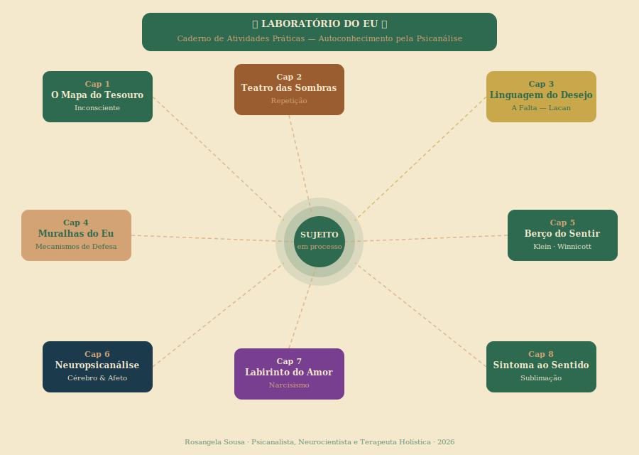

# Laboratório do Eu
## Caderno de Atividades Práticas — Autoconhecimento pela Psicanálise

> **Módulo Complementar | Curso: Autoconhecimento pela Psicanálise**
> **8 Capítulos · Atividades reflexivas e escritas · Material para uso pessoal e intransferível**

---



---

## Uma Palavra Antes de Começar

Bem-vindo ao **Laboratório do Eu**.

Este não é um teste. Não há respostas certas ou erradas. Não há nota, não há julgamento — e não há ninguém avaliando o que você vai escrever aqui, exceto você mesmo.

O que você tem em mãos é um convite: o convite de se sentar consigo, de criar um espaço de escuta interna que, talvez, você nunca tenha experimentado de forma tão estruturada.

A psicanálise parte de uma premissa radical: **você não se conhece completamente**. E não porque seja descuidado ou superficial — mas porque parte de quem você é vive em uma camada que não é acessível diretamente pela razão. O inconsciente não faz escândalo. Ele sussurra. Ele age nas suas escolhas, nas suas reações, nos seus medos noturnos e nas suas paixões inexplicáveis.

Este caderno é um mapa para escutar esse sussurro.

Cada capítulo corresponde a um conceito psicanalítico central. Cada atividade foi pensada para **trazer esse conceito da teoria para a sua vida real** — para o seu cotidiano, suas relações, seu corpo, suas histórias.

---

## Como Usar Este Caderno

```
MODO DE USO RECOMENDADO

① Leia o capítulo inteiro antes de escrever
② Reserve um momento de silêncio — desligue notificações
③ Escreva sem autocensura — a primeira resposta costuma ser a mais verdadeira
④ Não releia enquanto escreve — revise só no final
⑤ Guarde este caderno. Ele vai se tornar um documento valioso da sua jornada
```

**Você pode avançar em ordem ou pular capítulos** — mas recomendo a sequência, pois cada capítulo constrói sobre o anterior.

---

## Mapa dos 8 Capítulos

| Capítulo | Tema Central | Conceito Psicanalítico | Atividade |
|----------|-------------|----------------------|-----------|
| Cap 1 | O Mapa do Tesouro | Inconsciente | O Iceberg das Decisões |
| Cap 2 | O Teatro das Sombras | Compulsão à Repetição | A Herança dos Padrões |
| Cap 3 | A Linguagem do Desejo | A Falta (Lacan) | O Objeto Brilhante |
| Cap 4 | As Muralhas do Eu | Mecanismos de Defesa | O Inventário de Proteção |
| Cap 5 | O Berço do Sentir | Relações de Objeto | Meu Porto Seguro |
| Cap 6 | Neuropsicanálise | Corpo e Afeto | Rastreamento Somático |
| Cap 7 | O Labirinto do Amor | Narcisismo | O Espelho do Outro |
| Cap 8 | Do Sintoma ao Sentido | Sublimação | A Reescrita do Roteiro |

---

## O Que Você Vai Precisar

- **Tempo:** Cada capítulo leva entre 20 e 40 minutos — sem pressa
- **Um caderno físico** (recomendado) ou documento digital privado
- **Honestidade consigo mesmo** — que é o ingrediente mais difícil e mais valioso
- **Gentileza** — o que você vai encontrar aqui às vezes pode doer um pouco. Isso faz parte

---

## Uma Nota Importante

> *Este caderno é uma ferramenta de autoconhecimento. Não substitui o processo analítico individual, a psicoterapia ou qualquer acompanhamento clínico. Se durante os exercícios você se deparar com conteúdos que geram sofrimento intenso, procure apoio profissional.*

---

## Navegação dos Capítulos

- [Capítulo 1 — O Mapa do Tesouro (Inconsciente)](cap-01-mapa-do-tesouro.md)
- [Capítulo 2 — O Teatro das Sombras (Repetição)](cap-02-teatro-das-sombras.md)
- [Capítulo 3 — A Linguagem do Desejo (A Falta)](cap-03-linguagem-do-desejo.md)
- [Capítulo 4 — As Muralhas do Eu (Defesas)](cap-04-muralhas-do-eu.md)
- [Capítulo 5 — O Berço do Sentir (Relações de Objeto)](cap-05-berco-do-sentir.md)
- [Capítulo 6 — Neuropsicanálise (Cérebro e Afeto)](cap-06-neuropsicanálise.md)
- [Capítulo 7 — O Labirinto do Amor (Narcisismo)](cap-07-labirinto-do-amor.md)
- [Capítulo 8 — Do Sintoma ao Sentido (Sublimação)](cap-08-sintoma-ao-sentido.md)

---

*Rosangela Sousa · Psicanalista, Neurocientista e Terapeuta Holística · 2026*
