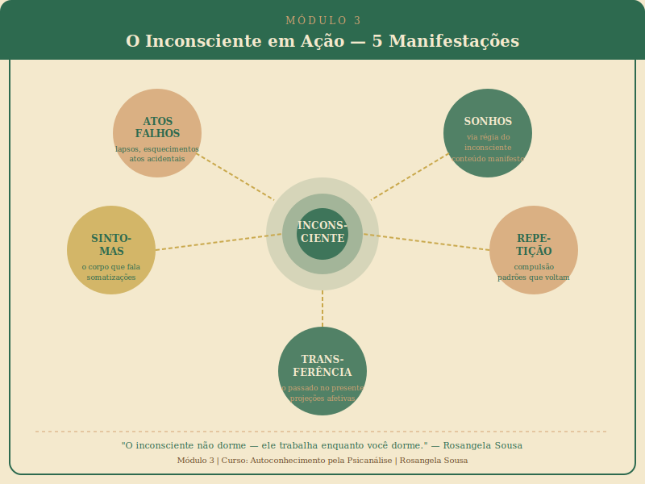

# Módulo 3 — O Inconsciente em Ação

> **Curso: Autoconhecimento pela Psicanálise | Carga: 2 horas | 5 aulas + 1 exercício**

---



---

## Apresentação do Módulo

Nos módulos anteriores, você conheceu o que é a psicanálise e como a psique está estruturada. Agora chegamos ao momento mais vivo e concreto do curso: **o inconsciente em ação**.

O inconsciente não é apenas uma teoria abstrata — ele se manifesta todos os dias, em situações que você já viveu dezenas de vezes sem saber o que estava acontecendo. Neste módulo, você vai aprender a ler essa linguagem sutil e poderosa.

Atos falhos, sonhos, sintomas físicos, padrões que se repetem, emoções que surgem em relações — tudo isso é o inconsciente falando. E a psicanálise é a arte de escutar essa fala.

---

## O Que Você Vai Aprender

```
┌──────────────────────────────────────────────────────────────┐
│  MÓDULO 3 — MAPA DE APRENDIZAGEM                            │
├──────────────────────────────────────────────────────────────┤
│  Aula 3.1  Atos falhos — quando o inconsciente fala alto    │
│  Aula 3.2  Sonhos — a via régia do inconsciente             │
│  Aula 3.3  Sintomas — o corpo que fala o que a mente cala   │
│  Aula 3.4  Repetição — por que repetimos o que nos faz mal  │
│  Aula 3.5  Transferência — o passado no presente            │
│  Exercício  Diário de sonhos — registro e reflexões         │
└──────────────────────────────────────────────────────────────┘
```

---

## Objetivos do Módulo

Ao finalizar o Módulo 3, você será capaz de:

1. Identificar atos falhos na sua vida cotidiana e refletir sobre seus significados
2. Compreender a estrutura dos sonhos segundo Freud e iniciar uma prática de registro e reflexão
3. Reconhecer a relação entre sofrimento emocional e manifestações físicas
4. Entender a compulsão à repetição e identificar padrões na própria história
5. Compreender a transferência como fenômeno presente em todas as relações

---

## Contextualização

> *"O inconsciente não dorme. Ele trabalha enquanto você dorme, enquanto você fala, enquanto você ama e enquanto você adoece."*
> — Rosangela Sousa

Freud tinha uma visão muito clara: o inconsciente não está atrás de uma parede hermeticamente fechada. Ele está constantemente buscando expressão — e encontra caminhos nos momentos em que a consciência está menos vigilante ou nos quais sua lógica peculiar pode infiltrar-se no comportamento cotidiano.

Este módulo é sobre aprender a ler esses sinais — não para se obcecar com análise de cada gesto, mas para desenvolver uma postura de curiosidade e abertura para o que o inconsciente está comunicando.

---

## Orientações para Este Módulo

- **Comece o diário de sonhos** já na primeira noite do módulo — quanto mais recente o sonho, mais detalhes você consegue registrar
- **Observe seus atos falhos** ao longo da semana — não com vergonha, mas com curiosidade
- **Note padrões** em suas relações: onde você percebe repetições?
- O exercício final é o mais exigente do curso em termos de prática diária

---

*Que comecem as revelações.*
