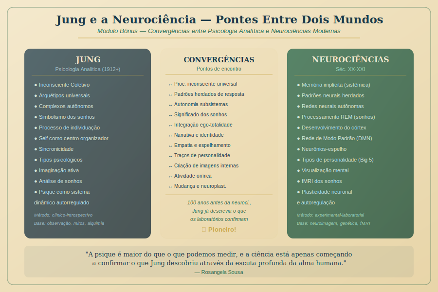

# Módulo Bônus — Jung e a Neurociência

> **Carga Horária: 1 hora | Curso: Jung e os Arquétipos**

---

---

## Apresentação do Módulo

Este módulo bônus é um presente especial para os alunos que querem ir além.

Aqui vamos construir pontes entre dois mundos que aparentemente falam idiomas diferentes: a **Psicologia Analítica de Jung** (com sua linguagem de arquétipos, Self e inconsciente coletivo) e as **Neurociências modernas** (com sua linguagem de redes neurais, neuroplasticidade e processamento cerebral).

Veremos que Jung foi, em muitos aspectos, um neurocientista antes que a neurociência existisse como campo — e que a ciência moderna está começando a confirmar o que ele descobriu através da escuta profunda da alma humana.

---

## Estrutura do Módulo

| Aula | Título | Duração |
|------|--------|---------|
| Bônus 1 | O que as neurociências dizem sobre o inconsciente coletivo | 30 min |
| Bônus 2 | Arquétipos e padrões neurais — pontos de convergência | 30 min |

---

## Aulas do Módulo

1. [Aula Bônus 1 — Neurociências e o Inconsciente Coletivo](aula-bonus-01-neurociencias-inconsciente.md)
2. [Aula Bônus 2 — Arquétipos e Padrões Neurais](aula-bonus-02-arquetipos-padroes-neurais.md)

---

*Módulo Bônus | Jung e os Arquétipos — Rosangela Sousa, 2026*
