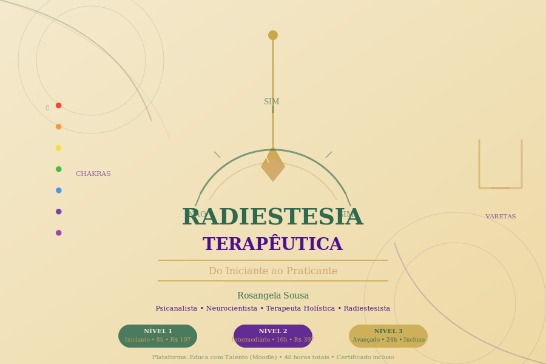

# Curso 3 — Radiestesia Terapêutica: Do Iniciante ao Praticante



> **Plataforma:** Educa com Talento (Moodle)
> **Instrutora:** Rosangela Sousa — Psicanalista, Neurocientista, Terapeuta Holística e Radiestesista
> **Carga horária total:** 48 horas
> **Certificado:** Incluso nos 3 níveis

---

## Sobre Este Curso

A **Radiestesia Terapêutica** é uma das ferramentas mais antigas e fascinantes da história da humanidade. Presente em culturas milenares de todos os continentes, ela ressurge hoje com força renovada no campo das terapias integrativas e complementares, reconhecidas pelo Ministério da Saúde através da Política Nacional de Práticas Integrativas e Complementares (PNPIC).

Neste curso, você aprenderá a Radiestesia com rigor, ética e responsabilidade — sem misticismo excessivo, mas também sem negar a profundidade espiritual da prática. Partiremos dos fundamentos históricos e das hipóteses científicas que tentam explicar o fenômeno, passaremos pela prática com diferentes instrumentos, exploraremos os gráficos radiestésicos, a avaliação de chakras, a integração com outras terapias, e chegaremos ao desenvolvimento do seu próprio protocolo autoral.

---

## Estrutura do Curso

```
┌─────────────────────────────────────────────────────────────────┐
│              RADIESTESIA TERAPÊUTICA — 48 HORAS                 │
├──────────────────┬──────────────────────┬───────────────────────┤
│   NÍVEL 1        │   NÍVEL 2            │   NÍVEL 3             │
│   Iniciante      │   Intermediário      │   Avançado            │
│   8 horas        │   16 horas           │   24 horas            │
│   R$ 197         │   R$ 397             │   Incluso no pacote   │
├──────────────────┴──────────────────────┴───────────────────────┤
│   PACOTE COMPLETO — R$ 497 (economia de R$ 97)                  │
└─────────────────────────────────────────────────────────────────┘
```

---

## Nível 1 — Iniciante (8 horas) | R$ 197

> *Ideal para quem nunca teve contato com a Radiestesia ou quer estabelecer bases sólidas.*

| Módulo | Tema | Carga Horária |
|--------|------|---------------|
| **1.1** | Fundamentos e Desmistificação | 2 horas |
| **1.2** | Conhecendo os Instrumentos | 2 horas |
| **1.3** | Primeira Prática | 2 horas |
| **1.4** | Integração e Próximos Passos | 2 horas |

**O que você vai aprender:**
- ✦ O que é Radiestesia — história e definição sem exageros
- ✦ O que a ciência diz (e o que ainda não sabe)
- ✦ Uma leitura neurocientífica da intuição radiestésica
- ✦ Como escolher seu pêndulo e calibrá-lo
- ✦ Os primeiros movimentos e sua interpretação
- ✦ Ética e limites desde o início

---

## Nível 2 — Intermediário (16 horas) | R$ 397

> *Para quem já tem os fundamentos e quer aprofundar técnica e aplicações terapêuticas.*

| Módulo | Tema | Carga Horária |
|--------|------|---------------|
| **2.1** | Aprofundando a Prática | 3 horas |
| **2.2** | Gráficos Radiestésicos Completos | 4 horas |
| **2.3** | Radiestesia e Chakras | 3 horas |
| **2.4** | Casos Práticos e Protocolos | 3 horas |
| **2.5** | Integração com Outras Práticas | 3 horas |

**O que você vai aprender:**
- ✦ Uso avançado do pêndulo e trabalho com fotografias e simbologias
- ✦ Todos os tipos de gráficos radiestésicos — como usar e como criar
- ✦ Avaliação e equilíbrio de chakras com o pêndulo
- ✦ Como estruturar uma sessão completa com protocolo
- ✦ Integração da Radiestesia com Psicanálise, Aromaterapia, Cristaloterapia e Florais

---

## Nível 3 — Avançado (24 horas) | Incluso no Pacote Completo

> *Formação completa para o exercício profissional ético e competente da Radiestesia Terapêutica.*

| Módulo | Tema | Carga Horária |
|--------|------|---------------|
| **3.1** | Radiestesia Terapêutica Aplicada | 5 horas |
| **3.2** | Supervisão de Casos | 5 horas |
| **3.3** | Técnicas Avançadas | 5 horas |
| **3.4** | Ética e Prática Profissional | 4 horas |
| **3.5** | Projeto Final e Certificação | 5 horas |

**O que você vai aprender:**
- ✦ Protocolo completo de mapeamento bioenergético
- ✦ Análise de casos reais anonimizados com supervisão
- ✦ Técnicas avançadas: esfera de influência, registros akáshicos, campo mórfico
- ✦ Legislação brasileira sobre terapias complementares
- ✦ Desenvolvimento e defesa do seu protocolo autoral

---

## Para Quem é Este Curso?

| Perfil | Por que fazer |
|--------|---------------|
| **Terapeuta holística iniciante** | Adquirir a base para usar a Radiestesia com segurança |
| **Profissional de saúde integrada** | Ampliar o arsenal terapêutico com uma ferramenta reconhecida |
| **Praticante de terapias complementares** | Integrar a Radiestesia às práticas já desenvolvidas |
| **Estudante de psicanálise** | Explorar a interface entre o inconsciente e a consciência corporal |
| **Pessoa em autodesenvolvimento** | Acessar autoconhecimento através de uma prática concreta |

---

## Metodologia

Este curso combina:

- **Aulas em vídeo** — narradas pela Rosangela com clareza e acolhimento
- **Material de estudo rico** — apostilas, gráficos para impressão, tabelas de referência
- **Práticas guiadas** — exercícios passo a passo com orientação detalhada
- **Diário de prática** — ferramenta de registro e evolução pessoal
- **Supervisão de casos** (Nível 3) — análise e feedback de sessões simuladas
- **Projeto Final** (Nível 3) — desenvolvimento do protocolo autoral

---

## Suporte Técnico e Ético

> *"A Radiestesia não é adivinhação. É uma ferramenta de escuta — de você, do outro e do campo que nos envolve."*
> — Rosangela Sousa

Este curso adota postura ética clara:
- Não substituímos diagnóstico médico ou psicológico
- Trabalhamos com consentimento informado
- Respeitamos os limites de atuação das terapias complementares
- Seguimos as diretrizes da PNPIC e do CFP (quando aplicável)

---

## Certificação

Ao concluir cada nível, você recebe:

| Nível | Certificado | Carga Horária no Certificado |
|-------|-------------|------------------------------|
| Nível 1 | Certificado de Iniciante em Radiestesia | 8 horas |
| Nível 2 | Certificado de Radiestesista Intermediária | 24 horas (acumulado) |
| Nível 3 | Certificado de Radiestesista Terapêutica | 48 horas (completo) |

---

## Recursos do Curso

- 📁 **7 SVGs ilustrativos** — diagramas profissionais para estudo e impressão
- 📋 **Gráficos para download e impressão** — pêndulo, chakras, estados emocionais
- 📓 **Diário de Prática** — template para evolução pessoal
- 📄 **Template de Protocolo Autoral** (Nível 3)
- 🔖 **Fichas de Anamnese Radiestésica**

---

## Navegação do Curso

- [Nível 1 — Iniciante](./nivel-1-iniciante/README.md)
- [Nível 2 — Intermediário](./nivel-2-intermediario/README.md)
- [Nível 3 — Avançado](./nivel-3-avancado/README.md)

---

*Curso desenvolvido por Rosangela Sousa | CECyber Education | 2026*
*Plataforma: Educa com Talento — Moodle*
