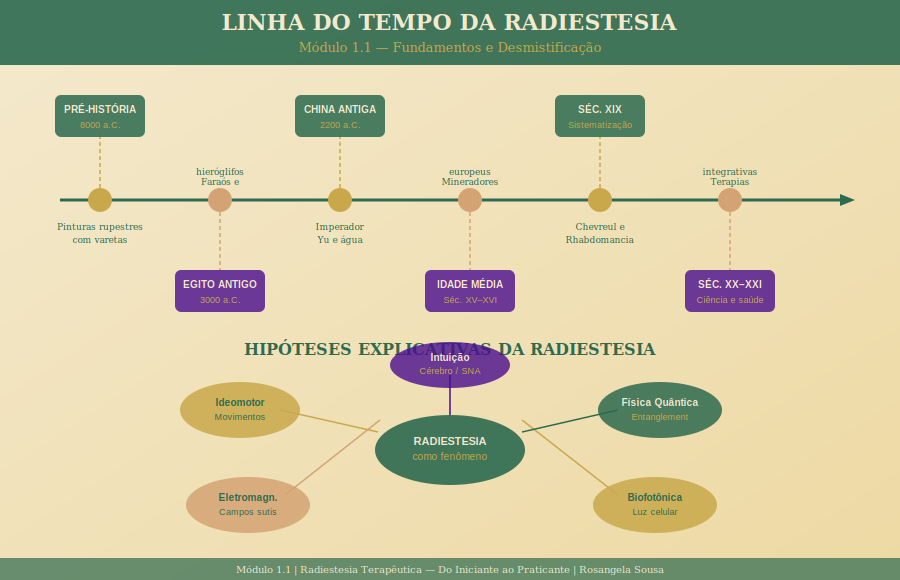

# Módulo 1.1 — Fundamentos e Desmistificação

> **Nível 1 | Carga horária:** 2 horas | **Aulas:** 5 + 1 exercício

---

## Sobre este Módulo

Este módulo é o seu ponto de partida. Antes de pegar qualquer instrumento, você precisa entender **o que é** a Radiestesia — sua história, seus fundamentos, suas limitações e seu potencial.

Aqui desfazemos mitos (no bom sentido: liberamos a prática de superstições desnecessárias) e também resistências (você não precisa "acreditar cegamente" — pode explorar com curiosidade científica).

---

## Aulas deste Módulo

| # | Aula | Duração |
|---|------|---------|
| 1 | [O que é Radiestesia](./aula-01-o-que-e-radiestesia.md) | 20 min |
| 2 | [Radiestesia ao longo da história](./aula-02-historia-radiestesia.md) | 20 min |
| 3 | [Base científica e hipóteses explicativas](./aula-03-base-cientifica.md) | 25 min |
| 4 | [Radiestesia, intuição e sistema nervoso](./aula-04-intuicao-sistema-nervoso.md) | 25 min |
| 5 | [Ética na Radiestesia](./aula-05-etica-radiestesia.md) | 20 min |
| — | [Exercício: Questionário de abertura](./exercicio-questionario-abertura.md) | 10 min |

---

## Objetivos do Módulo

Ao final deste módulo, você será capaz de:

1. Definir Radiestesia com precisão e sem exageros
2. Contextualizar a prática em sua trajetória histórica milenar
3. Descrever pelo menos duas hipóteses científicas sobre o fenômeno
4. Explicar a relação entre Radiestesia, intuição e sistema nervoso autônomo
5. Identificar os princípios éticos fundamentais da prática

---

*[← Voltar ao Nível 1](../README.md) | [Módulo 1.2 →](../modulo-1-2/README.md)*
