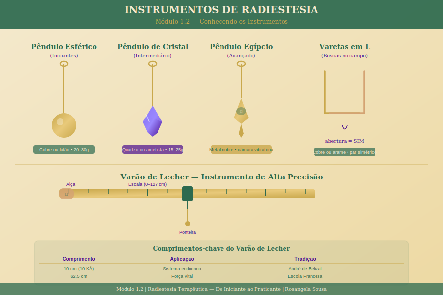

# Módulo 1.2 — Conhecendo os Instrumentos

> **Nível 1 | Carga horária:** 2 horas | **Aulas:** 5 + 1 exercício

---

## Sobre este Módulo

Os instrumentos da Radiestesia são pontes entre o sutil e o visível — eles amplificam respostas que o seu sistema nervoso já produziu. Neste módulo, você vai conhecer os principais instrumentos em profundidade: os pêndulos (esférico, de cristal, egípcio), as varetas em L e o Varão de Lecher.

Mas mais importante do que conhecer os instrumentos é entender como escolher o que é certo para você — e como criar uma relação de confiança e calibração com ele.

---

## Aulas deste Módulo

| # | Aula | Duração |
|---|------|---------|
| 1 | [Tipos de pêndulos e como escolher o seu](./aula-01-tipos-de-pendulos.md) | 20 min |
| 2 | [O Varão de Lecher — apresentação e usos básicos](./aula-02-varao-de-lecher.md) | 20 min |
| 3 | [As varetas radiestésicas — anatomia e primeiros usos](./aula-03-varetas-radiestesicas.md) | 20 min |
| 4 | [Limpeza e cuidado com os instrumentos](./aula-04-limpeza-instrumentos.md) | 15 min |
| 5 | [Calibração pessoal — estabelecendo sim, não e neutro](./aula-05-calibracao-pessoal.md) | 25 min |
| — | [Exercício: Primeiros movimentos com o pêndulo](./exercicio-primeiros-movimentos.md) | 20 min |

---

*[← Módulo 1.1](../modulo-1-1/README.md) | [Módulo 1.3 →](../modulo-1-3/README.md)*
