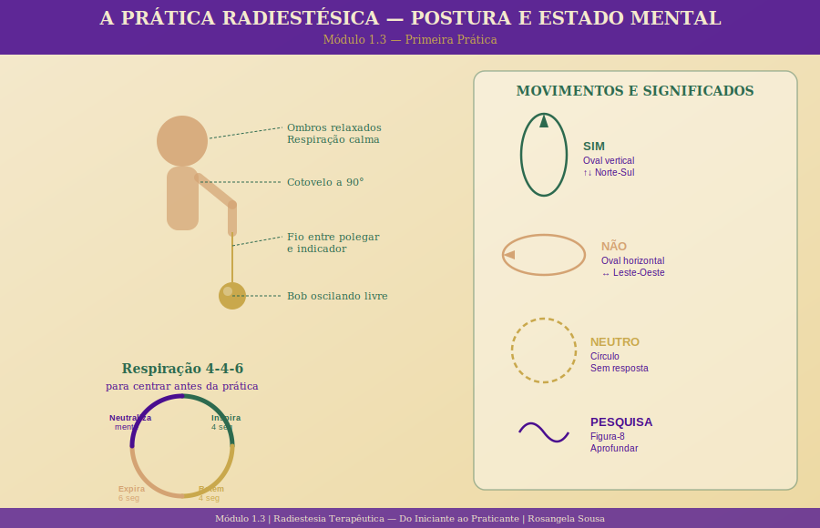

# Módulo 1.3 — Primeira Prática

> **Nível 1 | Carga horária:** 2 horas | **Aulas:** 5 + 1 exercício

---

## Sobre este Módulo

A teoria tem valor — mas é na prática que a Radiestesia ganha vida. Neste módulo, você vai aprender a postura, a respiração e o estado mental corretos para praticar; vai entender por que a neutralidade emocional é tão importante; vai fazer seus primeiros exercícios de calibração com objetos neutros; e vai criar um diário de prática que vai acompanhar toda a sua jornada.

---

## Aulas deste Módulo

| # | Aula | Duração |
|---|------|---------|
| 1 | [Postura, respiração e estado mental ideal](./aula-01-postura-respiracao.md) | 20 min |
| 2 | [A importância da neutralidade emocional](./aula-02-neutralidade-emocional.md) | 20 min |
| 3 | [Exercícios de calibração com objetos neutros](./aula-03-calibracao-objetos.md) | 25 min |
| 4 | [Introdução aos gráficos radiestésicos básicos](./aula-04-graficos-basicos.md) | 20 min |
| 5 | [Diário de prática — como registrar e evoluir](./aula-05-diario-de-pratica.md) | 15 min |
| — | [Exercício prático guiado](./exercicio-pratica-guiada.md) | 20 min |

---

*[← Módulo 1.2](../modulo-1-2/README.md) | [Módulo 1.4 →](../modulo-1-4/README.md)*
