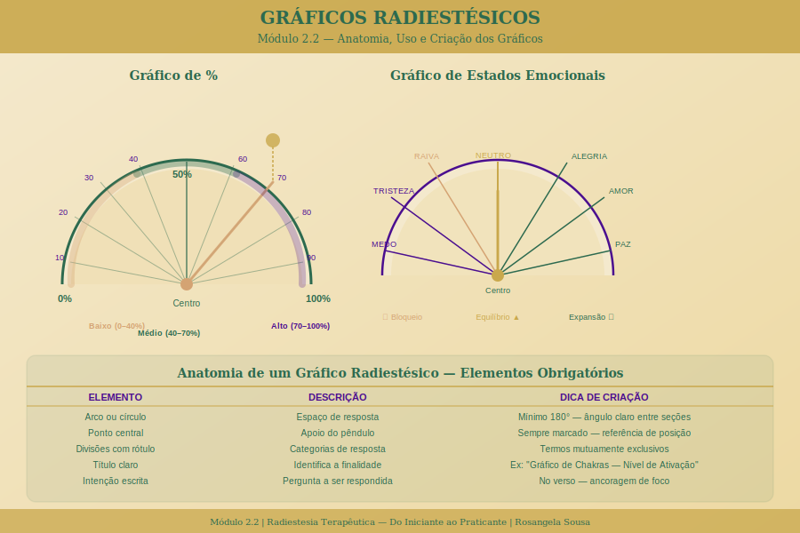

# Módulo 2.2 — Gráficos Radiestésicos Completos

> **Nível 2 | Carga horária:** 4 horas | **Aulas:** 7 + download

---

| # | Aula | Duração |
|---|------|---------|
| 1 | [Anatomia de um gráfico radiestésico](./aula-01-anatomia-grafico.md) | 20 min |
| 2 | [Gráfico de porcentagem — usos e limitações](./aula-02-grafico-porcentagem.md) | 30 min |
| 3 | [Gráficos de chakras](./aula-03-graficos-chakras.md) | 45 min |
| 4 | [Gráfico de estados emocionais](./aula-04-estados-emocionais.md) | 40 min |
| 5 | [Gráfico de órgãos e sistemas](./aula-05-orgaos-sistemas.md) | 40 min |
| 6 | [Criando seus próprios gráficos](./aula-06-criando-graficos.md) | 30 min |
| 7 | [Prática com todos os gráficos — casos simulados](./aula-07-pratica-casos.md) | 35 min |
| — | [Gráficos para download](./graficos-para-download.md) | — |

*[← Módulo 2.1](../modulo-2-1/README.md) | [Módulo 2.3 →](../modulo-2-3/README.md)*
