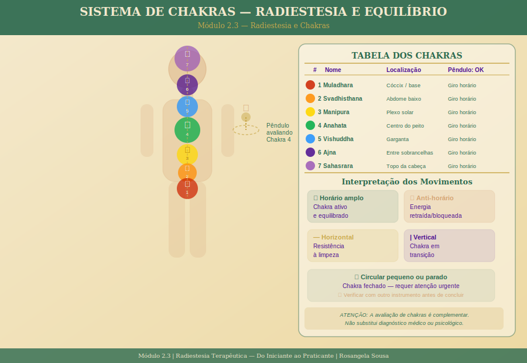

# Módulo 2.3 — Radiestesia e Chakras

> **Nível 2 | Carga horária:** 3 horas | **Aulas:** 5 + prática

| # | Aula | Duração |
|---|------|---------|
| 1 | [O sistema de chakras — fundamentos e tradições](./aula-01-sistema-chakras.md) | 30 min |
| 2 | [Avaliando chakras com o pêndulo — técnica completa](./aula-02-avaliando-chakras.md) | 35 min |
| 3 | [Interpretando os movimentos do pêndulo em chakras](./aula-03-interpretando-movimentos.md) | 30 min |
| 4 | [Técnicas de equilíbrio e harmonização com o pêndulo](./aula-04-equilibrio-harmonizacao.md) | 35 min |
| 5 | [Registros e acompanhamento ao longo do tempo](./aula-05-registros-acompanhamento.md) | 20 min |
| — | [Prática supervisionada](./pratica-supervisionada.md) | 30 min |

*[← Módulo 2.2](../modulo-2-2/README.md) | [Módulo 2.4 →](../modulo-2-4/README.md)*
