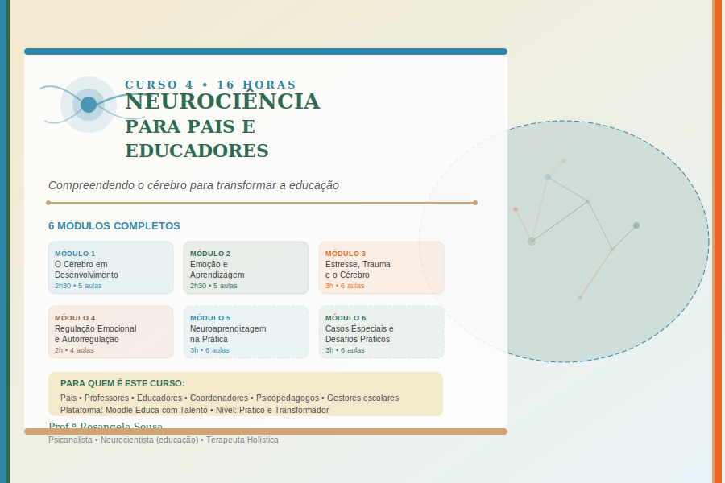
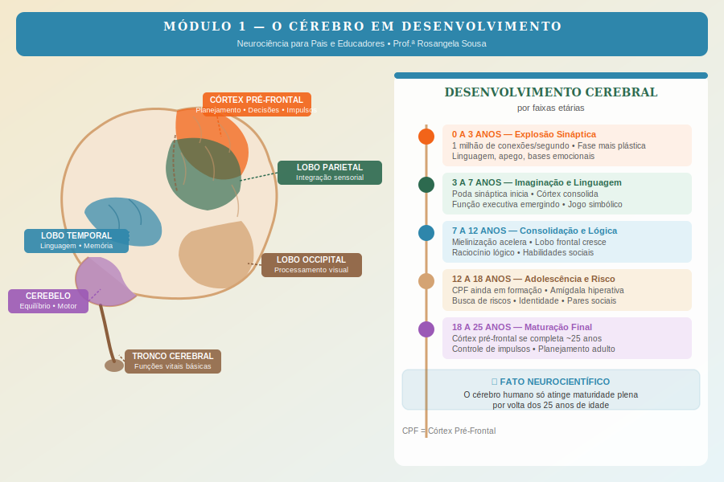
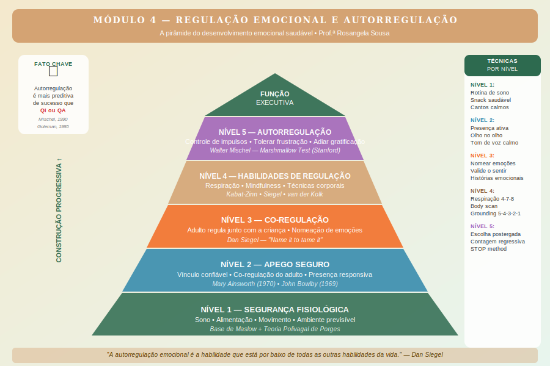

# Curso 4 — Neurociência para Pais e Educadores

> **Plataforma:** Moodle Educa com Talento
> **Carga horária:** 16 horas
> **Nível:** Prático e Transformador
> **Público-alvo:** Pais, professores, educadores, coordenadores pedagógicos e psicopedagogos

---

## Sobre o Curso

Este curso nasce de uma convicção profunda: quando pais e educadores compreendem como o cérebro funciona, tudo muda. A forma como conversamos com as crianças muda. A forma como reagimos às birras muda. A forma como estruturamos ambientes de aprendizagem muda. E, sobretudo, o que esperamos de crianças e adolescentes — em termos de comportamento e capacidade — muda de forma radical.

A neurociência da educação não é um conjunto de regras rígidas. É um conjunto de lentes. Com essas lentes, você passa a enxergar por que uma criança "não consegue se concentrar" (talvez ela nem tenha desenvolvido ainda a estrutura cerebral necessária para isso), por que um adolescente "age sem pensar" (porque o córtex pré-frontal, responsável por planejar consequências, só fica maduro por volta dos 25 anos), e por que certas estratégias pedagógicas funcionam enquanto outras, por mais bem-intencionadas que sejam, simplesmente não chegam ao cérebro.

**Prof.ª Rosangela Sousa** — Psicanalista, Neurocientista (educação) e Terapeuta Holística — conduz você por uma jornada de 16 horas que integra ciência rigorosa com aplicação prática imediata no cotidiano familiar e escolar.

---

## Estrutura do Curso

| Módulo | Título | Aulas | Duração |
|--------|--------|-------|---------|
| 1 | O Cérebro em Desenvolvimento | 5 | 2h30 |
| 2 | Emoção e Aprendizagem | 5 | 2h30 |
| 3 | Estresse, Trauma e o Cérebro | 6 | 3h |
| 4 | Regulação Emocional e Autorregulação | 4 | 2h |
| 5 | Neuroaprendizagem na Prática | 6 | 3h |
| 6 | Casos Especiais e Desafios Práticos | 6 | 3h |
| **Total** | | **32 aulas** | **16 horas** |

---

## Módulo 1 — O Cérebro em Desenvolvimento

Neste módulo você vai compreender a estrutura básica do cérebro, como ele se desenvolve desde o nascimento até a idade adulta, e quais são as implicações práticas desse desenvolvimento para quem educa crianças e adolescentes.

### Aulas:
- [Aula 1.1 — Neurociência básica: o que todo educador precisa saber](modulo-01/aula-01-neurociencia-basica.md)
- [Aula 1.2 — Desenvolvimento cerebral de 0 a 25 anos](modulo-01/aula-02-desenvolvimento-0-a-25-anos.md)
- [Aula 1.3 — O cérebro da criança é diferente do cérebro adulto](modulo-01/aula-03-cerebro-crianca-vs-adulto.md)
- [Aula 1.4 — O papel do córtex pré-frontal: por que adolescentes parecem sem juízo](modulo-01/aula-04-cortex-prefrontal-adolescentes.md)
- [Aula 1.5 — Janelas de oportunidade: períodos críticos do desenvolvimento](modulo-01/aula-05-janelas-de-oportunidade.md)

---

## Módulo 2 — Emoção e Aprendizagem

A emoção não é o oposto da razão — ela é a base da aprendizagem. Neste módulo exploramos como o sistema límbico, os neurônios-espelho e neurotransmissores como a dopamina tornam o aprendizado possível ou impossível.

### Aulas:
- [Aula 2.1 — O sistema límbico: o papel central das emoções no aprendizado](modulo-02/aula-01-sistema-limbico.md)
- [Aula 2.2 — Memória emocional: por que aprendemos melhor quando sentimos](modulo-02/aula-02-memoria-emocional.md)
- [Aula 2.3 — Neurônios-espelho: empatia, imitação e aprendizagem social](modulo-02/aula-03-neuronios-espelho.md)
- [Aula 2.4 — Dopamina, motivação e prazer no aprendizado](modulo-02/aula-04-dopamina-motivacao.md)
- [Aula 2.5 — O estado emocional do professor afeta o aluno: a ciência da co-regulação](modulo-02/aula-05-co-regulacao.md)

---

## Módulo 3 — Estresse, Trauma e o Cérebro

O estresse crônico e o trauma deixam marcas neurológicas reais e mensuráveis. Este é o módulo mais importante para quem trabalha com crianças vulneráveis — e para compreender por que comportamentos difíceis são frequentemente respostas de sobrevivência, não má vontade.

### Aulas:
- [Aula 3.1 — O que o estresse faz com o cérebro de uma criança](modulo-03/aula-01-estresse-cerebro-crianca.md)
- [Aula 3.2 — Trauma na infância e suas marcas neurológicas](modulo-03/aula-02-trauma-marcas-neurologicas.md)
- [Aula 3.3 — Adversidade na infância (ACEs): o que é e como mitigar](modulo-03/aula-03-adversidade-aces.md)
- [Aula 3.4 — A amígdala e o "sequestro emocional": quando a criança "perde a cabeça"](modulo-03/aula-04-amigdala-sequestro-emocional.md)
- [Aula 3.5 — Como criar ambientes seguros que reduzem o estresse](modulo-03/aula-05-ambientes-seguros.md)
- [Aula 3.6 — Estratégias de co-regulação: o que fazer durante uma crise emocional](modulo-03/aula-06-estrategias-co-regulacao.md)

---

## Módulo 4 — Regulação Emocional e Autorregulação

A autorregulação emocional é a habilidade que está por baixo de todas as outras. Sem ela, nenhum conteúdo acadêmico chega ao destino. Este módulo mostra como construir essa habilidade desde a primeira infância.

### Aulas:
- [Aula 4.1 — O que é autorregulação e por que é mais importante que QI](modulo-04/aula-01-autorregulacao.md)
- [Aula 4.2 — Como o apego seguro constrói a autorregulação](modulo-04/aula-02-apego-seguro.md)
- [Aula 4.3 — Técnicas de regulação emocional para crianças (com base em neurociência)](modulo-04/aula-03-tecnicas-regulacao-emocional.md)
- [Aula 4.4 — Mindfulness para crianças: como introduzir na sala de aula e em casa](modulo-04/aula-04-mindfulness-criancas.md)

---

## Módulo 5 — Neuroaprendizagem na Prática

Como aplicar neurociência no dia a dia educacional. Das metodologias ativas ao papel do sono, do exercício físico à alimentação — este módulo transforma ciência em estratégias concretas para sala de aula e lar.

### Aulas:
- [Aula 5.1 — Metodologias ativas e sua base neurocientífica](modulo-05/aula-01-metodologias-ativas.md)
- [Aula 5.2 — Aprendizagem baseada em projetos: por que funciona para o cérebro](modulo-05/aula-02-aprendizagem-por-projetos.md)
- [Aula 5.3 — O papel do sono no aprendizado e na consolidação da memória](modulo-05/aula-03-sono-e-aprendizagem.md)
- [Aula 5.4 — Alimentação e cérebro: o básico que todo educador deveria saber](modulo-05/aula-04-alimentacao-e-cerebro.md)
- [Aula 5.5 — Exercício físico e função cognitiva: a ciência que surpreende](modulo-05/aula-05-exercicio-fisico-cognicao.md)
- [Aula 5.6 — Tecnologia e o cérebro: aliada ou vilã?](modulo-05/aula-06-tecnologia-e-cerebro.md)

---

## Módulo 6 — Casos Especiais e Desafios Práticos

TDAH, dislexia, ansiedade, altas habilidades, bullying — cada um com sua neurobiologia específica e estratégias baseadas em evidências. Este módulo encerra o curso com um olhar compassivo e cientificamente fundamentado sobre a diversidade dos cérebros.

### Aulas:
- [Aula 6.1 — TDAH: o que está acontecendo no cérebro e o que realmente ajuda](modulo-06/aula-01-tdah.md)
- [Aula 6.2 — Dislexia e dificuldades de leitura: abordagem neurológica](modulo-06/aula-02-dislexia-leitura.md)
- [Aula 6.3 — Ansiedade em crianças e adolescentes: sinais, causas e estratégias](modulo-06/aula-03-ansiedade-criancas.md)
- [Aula 6.4 — Altas habilidades: cérebros que aprendem de forma diferente](modulo-06/aula-04-altas-habilidades.md)
- [Aula 6.5 — Bullying e o cérebro: impactos e estratégias de prevenção](modulo-06/aula-05-bullying-cerebro.md)
- [Aula 6.6 — Quando encaminhar: sinais que pedem ajuda especializada](modulo-06/aula-06-quando-encaminhar.md)

---

## Principais Referências Científicas

| Autor | Obra | Contribuição |
|-------|------|-------------|
| Daniel J. Siegel | *The Developing Mind* (1999) | Neurobiologia interpessoal, Janela de Tolerância |
| Bessel van der Kolk | *O Corpo Guarda as Marcas* (2014) | Trauma e sistema nervoso |
| John Ratey | *SPARK* (2008) | Exercício físico e função cerebral |
| Mary Ainsworth | Teoria do Apego (1970) | Apego seguro e desenvolvimento |
| Russell Barkley | *ADHD and the Nature of Self-Control* | Neurobiologia do TDAH |
| Joseph LeDoux | *The Emotional Brain* (1996) | Amígdala e medo |
| Walter Mischel | Marshmallow Test, Stanford | Autorregulação e sucesso |
| Patricia Kuhl | Janelas de oportunidade | Períodos sensíveis da linguagem |
| Giacomo Rizzolatti | Neurônios-espelho (1996) | Empatia e aprendizagem social |
| Vincent Felitti | Estudo ACEs (CDC, 1998) | Adversidades na infância |

---

## Como Usar Este Material

Este curso foi desenvolvido para publicação na plataforma **Moodle do Educa com Talento**. Cada arquivo `.md` corresponde a uma aula que pode ser importada como página, tópico ou recurso de texto na plataforma.

Os arquivos SVG em `assets/` são diagramas visuais que podem ser incorporados nas aulas como imagens.

O **Roteiro de Narração** ao final de cada aula foi desenvolvido para gravação em vídeo, com tom caloroso, científico e acessível — como Rosangela Sousa se dirige a pais e educadores em suas consultas e workshops presenciais.

---

*Prof.ª Rosangela Sousa — Psicanalista • Neurocientista (educação) • Terapeuta Holística*
*Curso desenvolvido para o Educa com Talento — 2026*
