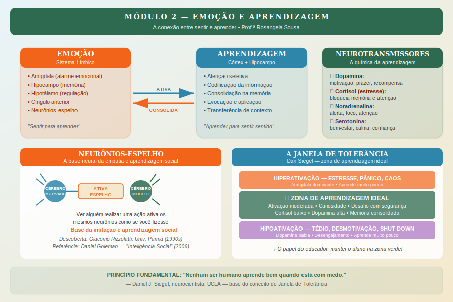

# Módulo 2 — Emoção e Aprendizagem

> **Carga horária:** 2h30 | **5 aulas** | Nível: Intermediário

---

## Apresentação do Módulo

Por décadas, a escola operou sob um pressuposto implícito: emoções são perturbações que atrapalham o aprendizado racional. O bom aluno seria aquele que "deixa os sentimentos do lado de fora" e se concentra no conteúdo.

A neurociência virou esse pressuposto de cabeça para baixo.

Sabemos hoje, com precisão anatômica e molecular, que a emoção e a cognição não são sistemas separados que competem entre si. Elas são **profundamente interligadas** — e, mais do que isso, a emoção é a porta de entrada de qualquer aprendizagem significativa.

O hipocampo, responsável pela consolidação de memórias, trabalha em estreita parceria com a amígdala, responsável pelo processamento emocional. Sem emoção, a memória não se consolida. Sem segurança emocional, a atenção não se sustenta. Sem motivação (dopamina), o aprendizado não acontece.

Este módulo explora a neurociência da emoção no aprendizado: o sistema límbico, a memória emocional, os neurônios-espelho, a dopamina e — numa das descobertas mais importantes para educadores — como o estado emocional do professor literalmente afeta o estado emocional do aluno.

---

## Objetivos do Módulo

1. Compreender o papel central do sistema límbico na aprendizagem
2. Entender como a emoção consolida ou bloqueia memórias
3. Conhecer os neurônios-espelho e suas implicações para aprendizagem social e empatia
4. Descrever como dopamina, motivação e prazer se conectam ao aprender
5. Reconhecer o impacto do estado emocional do educador sobre os alunos

---

## Aulas do Módulo

| Aula | Título | Duração |
|------|--------|---------|
| 2.1 | O sistema límbico: o papel central das emoções no aprendizado | 25 min |
| 2.2 | Memória emocional: por que aprendemos melhor quando sentimos | 25 min |
| 2.3 | Neurônios-espelho: empatia, imitação e aprendizagem social | 25 min |
| 2.4 | Dopamina, motivação e prazer no aprendizado | 25 min |
| 2.5 | O estado emocional do professor afeta o aluno: a ciência da co-regulação | 30 min |

---

## Conceitos-Chave do Módulo

- **Sistema límbico:** conjunto de estruturas cerebrais responsáveis pelas emoções e motivação
- **Amígdala:** alarme emocional; registra e acessa memórias com carga afetiva
- **Hipocampo:** arquivo de memórias; trabalha em parceria com a amígdala
- **Janela de Tolerância:** (Dan Siegel) zona de ativação emocional ótima para aprender
- **Neurônios-espelho:** disparam ao ver outros realizando ações — base da empatia e imitação
- **Dopamina:** neurotransmissor do prazer, motivação e antecipação de recompensa
- **Co-regulação:** processo pelo qual um sistema nervoso regula outro
- **Contágio emocional:** transmissão involuntária de estado emocional entre pessoas

---

## Referências do Módulo

- SIEGEL, D. J. *The Developing Mind.* Guilford Press, 1999.
- LEDOUX, Joseph. *The Emotional Brain.* Simon & Schuster, 1996.
- RIZZOLATTI, G.; CRAIGHERO, L. "The mirror-neuron system." *Annual Review of Neuroscience*, 2004.
- IMMORDINO-YANG, M. H. *Emotions, Learning and the Brain.* Norton, 2015.
- GOLEMAN, Daniel. *Inteligência Social.* Campus, 2006.
- SCHULTZ, Wolfram. "Dopamine reward prediction-error signaling." *Nature Neuroscience*, 2016.
