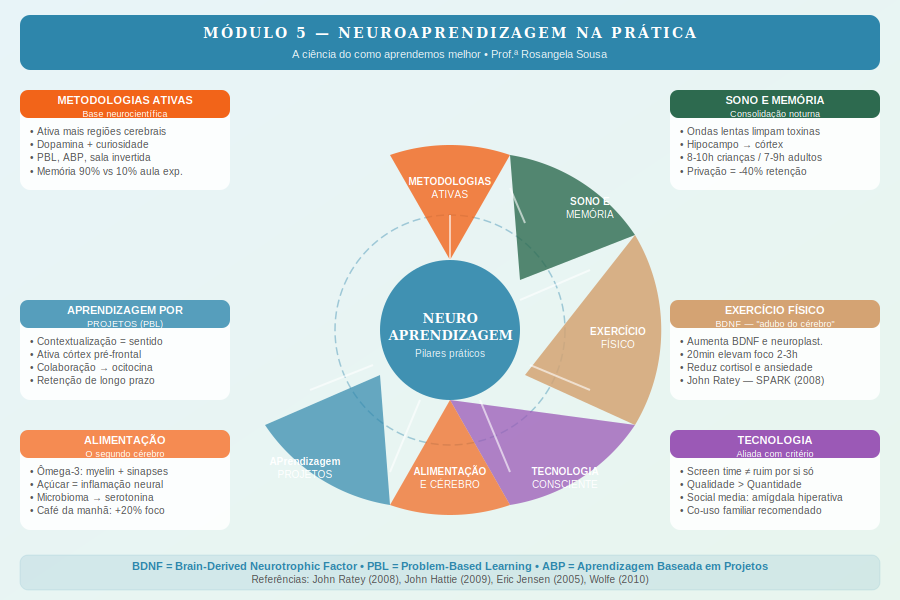

# Módulo 5 — Neuroaprendizagem na Prática

> **Carga horária:** 3h | **6 aulas** | Nível: Prático-Aplicado

---

## Apresentação do Módulo

Chegamos ao módulo mais operacional do curso. Tudo o que aprendemos sobre desenvolvimento cerebral, emoções, estresse e regulação agora se traduz em estratégias práticas para sala de aula e lar.

Neuroaprendizagem é a aplicação intencional da neurociência ao processo de ensinar e aprender. Não se trata de transformar professores em neurocientistas — mas de equipar educadores e pais com o conhecimento de *como o cérebro aprende de verdade*, para que possam criar condições que aproveitam (e não desperdiçam) o potencial de cada criança.

Este módulo cobre seis dimensões da neuroaprendizagem prática: metodologias ativas, aprendizagem por projetos, sono, alimentação, exercício físico e tecnologia. Cada uma dessas dimensões tem uma base neurocientífica robusta — e estratégias concretas de implementação.

---

## Objetivos do Módulo

1. Compreender a base neurocientífica das metodologias ativas de aprendizagem
2. Entender por que aprendizagem baseada em projetos é biologicamente mais eficaz
3. Reconhecer o papel do sono na consolidação de memórias e aprendizagem
4. Compreender como alimentação e exercício físico afetam a função cognitiva
5. Desenvolver uma perspectiva crítica e estratégica sobre tecnologia na educação

---

## Aulas do Módulo

| Aula | Título | Duração |
|------|--------|---------|
| 5.1 | Metodologias ativas e sua base neurocientífica | 30 min |
| 5.2 | Aprendizagem baseada em projetos: por que funciona para o cérebro | 25 min |
| 5.3 | O papel do sono no aprendizado e na consolidação da memória | 25 min |
| 5.4 | Alimentação e cérebro: o básico que todo educador deveria saber | 20 min |
| 5.5 | Exercício físico e função cognitiva: a ciência que surpreende | 20 min |
| 5.6 | Tecnologia e o cérebro: aliada ou vilã? | 20 min |

---

## Conceitos-Chave do Módulo

- **Pirâmide de aprendizagem:** diferentes estratégias de ensino têm taxas de retenção diferentes
- **BDNF:** Brain-Derived Neurotrophic Factor — "adubo do cérebro" liberado pelo exercício
- **Consolidação de memória:** processo noturno em que experiências diurnas são transferidas para memória de longo prazo
- **Sono de ondas lentas:** estágio de sono essencial para consolidação de memória declarativa
- **Ômega-3:** ácido graxo essencial para mielinização e sinapses
- **Scaffolding digital:** uso intencional de tecnologia como suporte ao aprendizado

---

## Referências do Módulo

- RATEY, John. *SPARK: The Revolutionary New Science of Exercise and the Brain.* Little, Brown, 2008.
- WALKER, Matthew. *Why We Sleep.* Scribner, 2017.
- JENSEN, Eric. *Teaching with the Brain in Mind.* ASCD, 2005.
- HATTIE, John. *Visible Learning.* Routledge, 2009.
- FERNANDEZ, Alvaro. *The SharpBrains Guide to Brain Fitness.* SharpBrains, 2013.
- BLUM, Deborah. *The Poisoner's Handbook.* Penguin, 2010.
