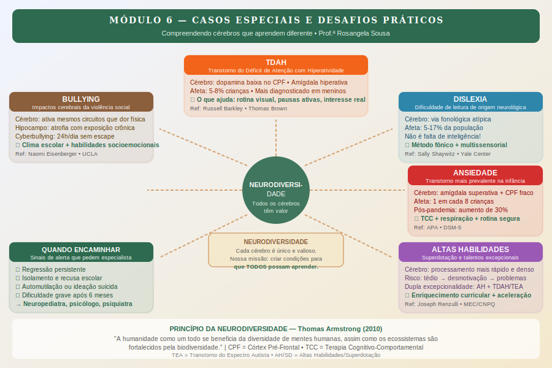

# Módulo 6 — Casos Especiais e Desafios Práticos

> **Carga horária:** 3h | **6 aulas** | Nível: Avançado-Especializado

---

## Apresentação do Módulo

Este módulo final aborda o que muitos pais e educadores consideram os maiores desafios práticos: as condições que tornam o aprendizado diferente — TDAH, dislexia, ansiedade, altas habilidades e bullying — e a questão fundamental de saber quando é hora de buscar ajuda especializada.

A perspectiva que permeia todo o módulo é a da **neurodiversidade**: a compreensão de que a diversidade de mentes humanas não é um problema a ser corrigido, mas uma realidade a ser compreendida e apoiada. Cada condição tem sua neurobiologia específica, suas forças e seus desafios — e a educação eficaz começa pela compreensão, não pelo enquadramento.

Ao final deste módulo, você terá uma visão fundamentada de cada condição — capaz de distinguir mito de realidade, de reconhecer o que realmente ajuda e de saber quando o apoio especializado é necessário.

---

## Objetivos do Módulo

1. Compreender a neurobiologia do TDAH e o que evidências mostram que realmente ajuda
2. Identificar a base neurológica da dislexia e abordagens de intervenção eficazes
3. Reconhecer sinais de ansiedade em crianças e desenvolver estratégias de suporte
4. Compreender altas habilidades como neurodiversidade — com forças e vulnerabilidades
5. Entender o impacto neurológico do bullying e estratégias de prevenção e intervenção
6. Desenvolver um guia prático para reconhecer quando encaminhar para suporte especializado

---

## Aulas do Módulo

| Aula | Título | Duração |
|------|--------|---------|
| 6.1 | TDAH: o que está acontecendo no cérebro e o que realmente ajuda | 35 min |
| 6.2 | Dislexia e dificuldades de leitura: abordagem neurológica | 30 min |
| 6.3 | Ansiedade em crianças e adolescentes: sinais, causas e estratégias | 30 min |
| 6.4 | Altas habilidades: cérebros que aprendem de forma diferente | 25 min |
| 6.5 | Bullying e o cérebro: impactos e estratégias de prevenção | 25 min |
| 6.6 | Quando encaminhar: sinais que pedem ajuda especializada | 15 min |

---

## Conceitos-Chave do Módulo

- **Neurodiversidade:** conceito de que diferenças neurológicas são variações humanas naturais
- **TDAH:** Transtorno do Déficit de Atenção com Hiperatividade — base dopaminérgica
- **Dislexia:** dificuldade de leitura de origem neurológica — via fonológica atípica
- **TEA:** Transtorno do Espectro Autista — processamento sensorial e social atípico
- **Dupla excepcionalidade:** combinação de altas habilidades com outra condição (TDAH, dislexia, etc.)
- **Bullying:** comportamento agressivo repetido com desequilíbrio de poder
- **Resiliência:** capacidade de recuperação após adversidade

---

## Referências do Módulo

- BARKLEY, Russell A. *Taking Charge of ADHD.* Guilford Press, 2020.
- SHAYWITZ, Sally. *Overcoming Dyslexia.* Knopf, 2020.
- KENDALL, Philip C.; HEDTKE, Kristina A. *Cognitive-Behavioral Therapy for Anxious Children.* Workbook Publishing, 2006.
- RENZULLI, Joseph S. "The three-ring conception of giftedness." *Systems and Models for Developing Programs for the Gifted and Talented*, 1986.
- OLWEUS, Dan. *Bullying at School.* Blackwell, 1993.
- EISENBERGER, Naomi. "Social pain and the brain." *Current Opinion in Neurobiology*, 2012.
