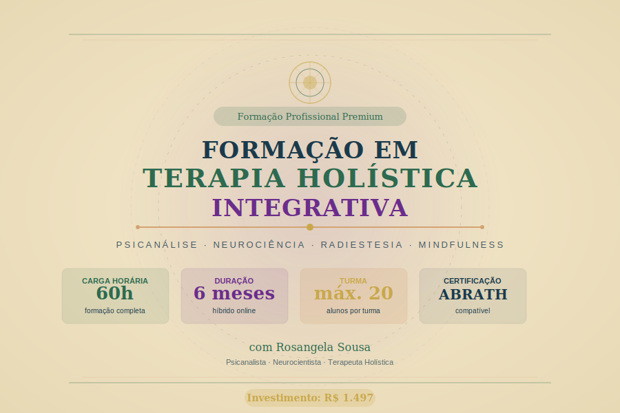

# Formação em Terapia Holística Integrativa
## Curso 05 — Programa Completo de Formação Profissional



---

> *"Cuidar do ser humano em sua integralidade não é uma escolha metodológica — é um compromisso ético com a vida."*
> — Rosangela Sousa

---

## Sobre Esta Formação

A **Formação em Terapia Holística Integrativa** é o programa mais completo do portfólio da Rosangela Sousa. Desenvolvida ao longo de anos de prática clínica integrando psicanálise, neurociência, radiestesia e práticas contemplativas, esta formação prepara terapeutas para uma atuação profissional sólida, ética e verdadeiramente transformadora.

Não se trata apenas de aprender técnicas. Esta formação convida você a uma transformação pessoal profunda — porque só pode conduzir alguém a lugares que você mesmo já percorreu.

---

## Visão Geral

| Item | Detalhe |
|------|---------|
| **Carga Horária Total** | 60 horas |
| **Investimento** | R$ 1.497 |
| **Formato** | Híbrido (aulas gravadas + 12 encontros ao vivo) |
| **Duração** | 6 meses |
| **Encontros Ao Vivo** | Quinzenais — sábados às 9h (duração: 2h30 cada) |
| **Turma Máxima** | 20 alunos |
| **Certificação** | Compatível com padrões ABRATH |
| **Plataforma** | Moodle do Educa com Talento |
| **Pré-requisito** | Nenhum obrigatório; interesse genuíno no autoconhecimento |

---

## O Que Você Vai Aprender

```
┌─────────────────────────────────────────────────────────┐
│         PILARES DA FORMAÇÃO HOLÍSTICA INTEGRATIVA       │
├────────────┬────────────┬────────────┬──────────────────┤
│ PSICANÁLISE│ NEUROCIÊNCIA│ RADIESTESIA│  MINDFULNESS     │
│ Aplicada   │ Clínica    │ Terapêutica│  Contemplativo   │
├────────────┴────────────┴────────────┴──────────────────┤
│              ÉTICA E PRÁTICA PROFISSIONAL               │
│          ESTÁGIO SUPERVISIONADO COM PROTOCOLO           │
└─────────────────────────────────────────────────────────┘
```

---

## Estrutura Curricular

### Módulo 1 — Fundamentos do Ser Humano Integral (8h)
Visão multidimensional do ser humano, sistemas energéticos, física quântica aplicada, medicina integrativa e legislação brasileira.

### Módulo 2 — Psicanálise Aplicada à Terapia Holística (10h)
Conceitos psicanalíticos essenciais, corpo que fala, escuta ativa, anamnese psicoemocional e estudos de caso supervisionados.

### Módulo 3 — Radiestesia Terapêutica Aplicada (8h)
Fundamentos, instrumentos, gráficos radiestésicos para chakras e emoções, integração na sessão holística.

### Módulo 4 — Neurociência para o Terapeuta (8h)
Cérebro e processo terapêutico, neuroplasticidade, trauma, sistema nervoso e técnicas de regulação baseadas em evidências.

### Módulo 5 — Mindfulness e Práticas Contemplativas (8h)
Fundamentos, base neurológica, prática formal, meditação terapêutica, grounding e preparação para retiro.

### Módulo 6 — Ética, Gestão e Prática Profissional (8h)
Ética profissional, limites de atuação, documentação, montagem de consultório, precificação ética e marketing.

### Módulo 7 — Estágio Supervisionado e Projeto Final (10h)
5 sessões com clientes reais, supervisão individual com Rosangela, protocolo terapêutico autoral e apresentação ao grupo.

---

## Cronograma dos 12 Encontros Ao Vivo

| Encontro | Sábado | Módulo | Tema Central |
|----------|--------|--------|-------------|
| 01 | Mês 1 — Semana 2 | Módulo 1 | Integração e prática energética |
| 02 | Mês 1 — Semana 4 | Módulo 1/2 | Ser humano multidimensional ao vivo |
| 03 | Mês 2 — Semana 2 | Módulo 2 | Psicanálise holística — supervisão de casos |
| 04 | Mês 2 — Semana 4 | Módulo 2/3 | Corpo que fala — prática corporal |
| 05 | Mês 3 — Semana 2 | Módulo 3 | Radiestesia — laboratório prático |
| 06 | Mês 3 — Semana 4 | Módulo 4 | Neurociência — dinâmica vivencial |
| 07 | Mês 4 — Semana 2 | Módulo 4/5 | Trauma e regulação — prática somática |
| 08 | Mês 4 — Semana 4 | Módulo 5 | **Retiro de Mindfulness (5h)** |
| 09 | Mês 5 — Semana 2 | Módulo 6 | Ética — estudos de caso em grupo |
| 10 | Mês 5 — Semana 4 | Módulo 6/7 | Gestão do consultório — mentoria |
| 11 | Mês 6 — Semana 2 | Módulo 7 | Supervisão de estágio |
| 12 | Mês 6 — Semana 4 | Módulo 7 | **Apresentação dos Protocolos — Cerimônia de Formatura** |

---

## Perfil do Formando Ideal

Esta formação é para você que:

- Quer construir uma prática terapêutica sólida e ética, não apenas coletar técnicas
- Busca integrar diferentes saberes em uma abordagem coerente e profissional
- Entende que o autoconhecimento é o primeiro instrumento do terapeuta
- Deseja atuar com segurança, dentro dos limites legais e éticos da profissão
- Tem comprometimento com os 6 meses de jornada — presencial e internamente

---

## Diferenciais da Formação

```
★ Formadora com experiência em Psicanálise, Neurociência e Radiestesia
★ Integração real entre abordagens — não uma colagem de técnicas
★ Supervisão individual com Rosangela (2 sessões de 30 min por aluno)
★ Estágio supervisionado com clientes reais
★ Protocolo terapêutico autoral — seu legado ao final da formação
★ Turma pequena (máx. 20 alunos) — atenção individualizada
★ Certificação compatível com padrões ABRATH
★ Comunidade de prática após a formação
```

---

## Certificação

Ao concluir todos os módulos, o estágio supervisionado e o projeto final, você recebe:

- **Certificado de Formação em Terapia Holística Integrativa** — 60 horas
- Emitido por Rosangela Sousa (Psicanalista, Neurocientista, Terapeuta Holística)
- Compatível com registro na ABRATH (Associação Brasileira de Terapeutas Holísticos)
- Habilitado para atuar com Terapia Holística Integrativa em consultório, clínicas e empresas

---

## Sobre Rosangela Sousa

Rosangela Sousa é psicanalista, neurocientista da educação e terapeuta holística com mais de 15 anos de prática integrativa. Ao longo dessa trajetória, desenvolveu um método próprio que une rigor científico, profundidade psicanalítica e sensibilidade energética — três dimensões que ela acredita serem inseparáveis em qualquer prática terapêutica verdadeiramente eficaz.

Esta formação é a síntese viva do seu método.

---

## Arquivos e Estrutura

```
curso-05-formacao-terapia-holistica/
├── README.md                              ← você está aqui
├── guia-do-formando.md                    Orientações para os 6 meses
├── calendario-encontros-ao-vivo.md        Cronograma detalhado
├── assets/                                SVGs ilustrativos
├── modulo-01/                             Fundamentos do Ser Humano Integral
├── modulo-02/                             Psicanálise Holística
├── modulo-03/                             Radiestesia Terapêutica
├── modulo-04/                             Neurociência
├── modulo-05/                             Mindfulness
├── modulo-06/                             Ética e Prática Profissional
└── modulo-07/                             Estágio e Projeto Final
```

---

*Formação em Terapia Holística Integrativa — Rosangela Sousa | 2026*
*Todos os direitos reservados. Material exclusivo para alunos matriculados.*
