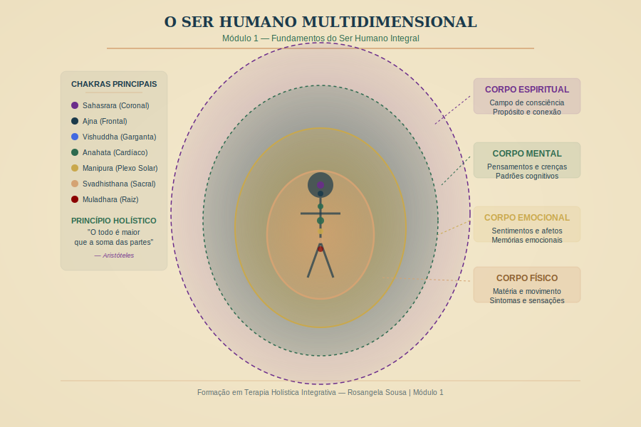

# Módulo 1 — Fundamentos do Ser Humano Integral

---

> *"Antes de cuidar de alguém, precisamos entender quem esse alguém é — em toda a sua complexidade e beleza."*
> — Rosangela Sousa

---

## Visão Geral do Módulo

Este é o alicerce de toda a sua formação. Aqui você vai construir a base conceitual que sustentará tudo o que aprenderá nos próximos 6 meses. Não pulamos etapas — e este módulo é o porquê.

Um terapeuta holístico que não compreende o ser humano em sua multidimensionalidade está trabalhando com fragmentos. Esta formação te convida a trabalhar com o todo.

---

## Carga Horária

**8 horas totais** — distribuídas em 8 aulas + prática integrativa

---

## Objetivos do Módulo

Ao concluir este módulo, você será capaz de:

1. Compreender as diferentes concepções de saúde e doença ao longo da história, identificando o que cada época trouxe de contribuição ao pensamento holístico
2. Descrever o ser humano em suas dimensões física, emocional, mental e espiritual com embasamento teórico e clínico
3. Identificar e localizar os principais sistemas energéticos do corpo humano — chakras, meridianos e campo áurico
4. Relacionar conceitos da física quântica com a prática terapêutica de forma fundamentada e responsável
5. Situar a terapia holística no contexto da medicina integrativa brasileira e mundial
6. Conhecer a legislação brasileira aplicável ao exercício das terapias complementares
7. Enunciar os princípios éticos fundamentais do terapeuta holístico

---

## Estrutura das Aulas

| Aula | Título | Duração |
|------|--------|---------|
| 1.1 | Visões de saúde e doença ao longo da história | 45 min |
| 1.2 | O ser humano multidimensional | 50 min |
| 1.3 | Sistemas energéticos do corpo humano | 60 min |
| 1.4 | Física quântica e consciência | 45 min |
| 1.5 | Medicina integrativa — contexto mundial e brasileiro | 45 min |
| 1.6 | Legislação brasileira sobre terapias complementares | 40 min |
| 1.7 | Princípios éticos do terapeuta holístico | 40 min |
| P | Prática integrativa do módulo | 55 min |

---

## Leituras Recomendadas

- CAPRA, Fritjof. *O Ponto de Mutação*. São Paulo: Cultrix.
- CHOPRA, Deepak. *Corpo sem Idade, Mente sem Fronteiras*.
- MINISTÉRIO DA SAÚDE. *Política Nacional de Práticas Integrativas e Complementares (PNPIC)*. 2006.
- WORLD HEALTH ORGANIZATION. *WHO Traditional Medicine Strategy 2019-2025*.
- LIPTON, Bruce. *A Biologia da Crença*. São Paulo: Butterfly.

---

## Reflexão de Abertura do Módulo

Antes de começar a Aula 1.1, reserve 10 minutos para esta reflexão no seu diário:

> *O que me fez chegar até aqui? O que me move em direção à terapia holística?*
> *Quando eu cuido de alguém, o que eu enxergo nessa pessoa?*

Não há respostas certas. O que importa é o contato honesto com sua motivação.

---

*Módulo 1 — Formação em Terapia Holística Integrativa | Rosangela Sousa | 2026*
