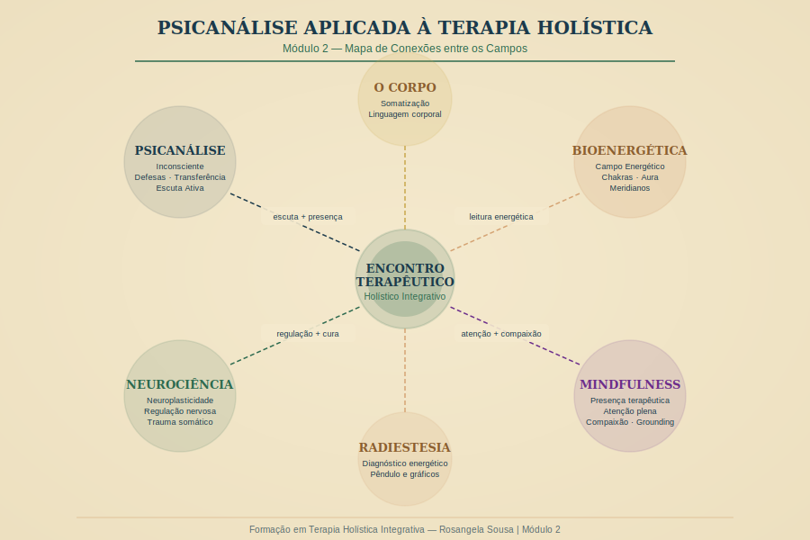

# Módulo 2 — Psicanálise Aplicada à Terapia Holística

---

> *"O inconsciente não é um depósito de conteúdos reprimidos. É um campo de possibilidades — e a terapia holística tem acesso a ele por múltiplas portas."*
> — Rosangela Sousa

---

## Visão Geral do Módulo

Este é o módulo mais denso e mais transformador da formação. Aqui você vai mergulhar nas profundezas da psique humana — e descobrir como o pensamento psicanalítico, longe de ser incompatível com o trabalho holístico, é seu aliado mais sofisticado.

A psicanálise oferece ao terapeuta holístico o mapa do interior. Os chakras, os meridianos, os campos energéticos — esses são mapas do campo. A psicanálise é o mapa da psique. Juntos, eles permitem uma leitura clínica de uma profundidade extraordinária.

---

## Carga Horária

**10 horas totais** — distribuídas em 8 aulas + supervisão prática

---

## Objetivos do Módulo

Ao concluir este módulo, você será capaz de:

1. Aplicar os conceitos psicanalíticos centrais (inconsciente, defesas, transferência) no contexto holístico
2. Identificar como padrões inconscientes se manifestam no corpo e no campo energético
3. Conduzir uma anamnese psicoemocional completa
4. Praticar escuta ativa e presença terapêutica com qualidade
5. Reconhecer e manejar transferência e contratransferência em sessões holísticas
6. Ler o corpo como linguagem — somatização e bioenergética
7. Analisar estudos de caso com olhar integrativo

---

## Estrutura das Aulas

| Aula | Título | Duração |
|------|--------|---------|
| 2.1 | Conceitos psicanalíticos essenciais para o terapeuta holístico | 50 min |
| 2.2 | Inconsciente e campo energético — diálogos possíveis | 45 min |
| 2.3 | Mecanismos de defesa e padrões energéticos | 55 min |
| 2.4 | Transferência e contratransferência no contexto holístico | 45 min |
| 2.5 | O corpo que fala — somatização e leitura bioenergética | 55 min |
| 2.6 | Escuta ativa e presença terapêutica | 50 min |
| 2.7 | Anamnese psicoemocional — roteiro completo | 45 min |
| 2.8 | Estudos de caso — análise e discussão | 55 min |
| S | Supervisão prática do módulo | 60 min |

---

## Referências Teóricas do Módulo

- FREUD, Sigmund. *A Interpretação dos Sonhos*; *Além do Princípio do Prazer*; *O Ego e o Id*
- JUNG, Carl Gustav. *O Eu e o Inconsciente*; *Psicologia do Inconsciente*
- VAN DER KOLK, Bessel. *O Corpo Guarda as Marcas*
- LEVINE, Peter. *O Despertar do Tigre*; *Trauma e Memória*
- LOWEN, Alexander. *Bioenergética*
- REICH, Wilhelm. *Análise do Caráter*
- ROGERS, Carl. *Tornar-se Pessoa*

---

*Módulo 2 — Formação em Terapia Holística Integrativa | Rosangela Sousa | 2026*
