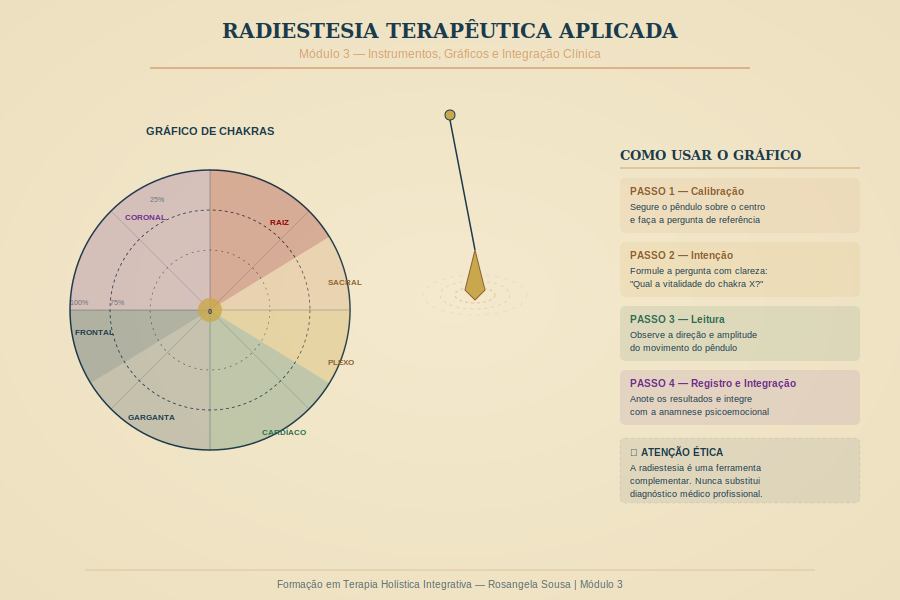

# Módulo 3 — Radiestesia Terapêutica Aplicada

---

> *"O pêndulo não decide — ele revela. A inteligência está em quem formula a pergunta."*
> — Rosangela Sousa

---

## Visão Geral

A radiestesia terapêutica é uma das ferramentas mais antigas e mais mal compreendidas no campo das terapias complementares. Neste módulo, você vai aprender a usá-la com rigor, precisão e responsabilidade ética — como instrumento de investigação qualitativa do campo energético, e não como oráculo infalível.

**Carga Horária:** 8 horas | **Formato:** 4 aulas de 2h + supervisão de casos

---

## Objetivos do Módulo

1. Compreender os fundamentos históricos e científicos da radiestesia
2. Dominar os principais instrumentos (pêndulo, varetas, biômetro)
3. Trabalhar com gráficos radiestésicos de chakras, emoções e vitalidade
4. Integrar a radiestesia de forma ética e coerente na sessão holística
5. Desenvolver seu próprio protocolo de uso da radiestesia

---

## Estrutura

| Aula | Tema | Duração |
|------|------|---------|
| 3.1 | Fundamentos e instrumentos | 2h |
| 3.2 | Gráficos radiestésicos — chakras e emoções | 2h |
| 3.3 | Integração na sessão holística | 2h |
| S | Supervisão de casos práticos | 2h |

---

*Módulo 3 — Formação em Terapia Holística Integrativa | Rosangela Sousa | 2026*
