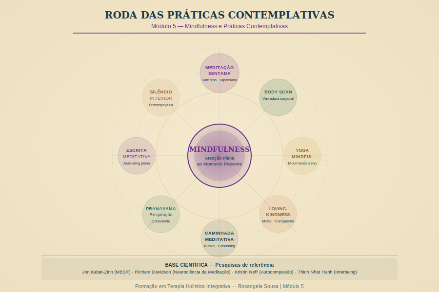

# Módulo 5 — Mindfulness e Práticas Contemplativas

---

> *"Mindfulness não é sobre esvaziar a mente — é sobre tornar-se consciente do que a mente está fazendo, sem ser arrastado por ela."*
> — Jon Kabat-Zinn

---

## Visão Geral

O mindfulness é, hoje, uma das práticas com maior base científica no campo da saúde mental e do bem-estar. Este módulo vai muito além de ensinar técnicas de meditação — vai desenvolver em você a capacidade de *ser* presença: para si mesmo e para seus clientes.

**Carga Horária:** 8 horas | **Encontro especial:** Retiro de 5h (Encontro 08)

---

## Objetivos do Módulo

1. Compreender os fundamentos históricos, filosóficos e científicos do mindfulness
2. Desenvolver uma prática pessoal sólida de mindfulness
3. Aplicar mindfulness como ferramenta terapêutica nas sessões
4. Cultivar a presença contemplativa como qualidade do terapeuta
5. Preparar-se para a experiência do Retiro de Mindfulness

---

## Estrutura

| Aula | Tema | Duração |
|------|------|---------|
| 5.1 | Fundamentos do mindfulness | 50 min |
| 5.2 | Base neurológica do mindfulness | 45 min |
| 5.3 | Prática formal de mindfulness | 50 min |
| 5.4 | Meditação como ferramenta terapêutica | 45 min |
| 5.5 | Mindfulness para o terapeuta | 50 min |
| 5.6 | Como introduzir mindfulness em sessões | 45 min |
| 5.7 | Práticas de grounding e ancoragem | 50 min |
| 5.8 | Preparação para o Retiro de Mindfulness | 40 min |

---

*Módulo 5 — Formação em Terapia Holística Integrativa | Rosangela Sousa | 2026*
