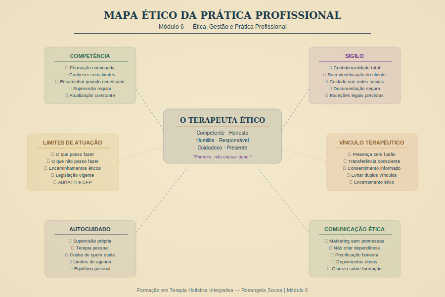

# Módulo 6 — Ética, Gestão e Prática Profissional

---

> *"Ser terapeuta é uma escolha que vai muito além de abrir um consultório. É um compromisso permanente com a integridade — com o cliente, com a profissão e com você mesmo."*
> — Rosangela Sousa

---

## Visão Geral

Este módulo prepara você para o exercício profissional real — com toda a complexidade, beleza e responsabilidade que isso implica. Da ética ao marketing, do prontuário à precificação, você vai sair deste módulo pronto para montar e conduzir uma prática holística profissional, sustentável e ética.

**Carga Horária:** 8 horas | **Encontros:** E09 (ética) + E10 (gestão)

---

## Estrutura

| Aula | Tema | Duração |
|------|------|---------|
| 6.1 | Ética profissional — casos práticos | 50 min |
| 6.2 | Limites de atuação | 45 min |
| 6.3 | Sigilo e confidencialidade | 40 min |
| 6.4 | Registro e documentação de sessões | 35 min |
| 6.5 | Como montar seu consultório | 45 min |
| 6.6 | Precificação ética | 35 min |
| 6.7 | Marketing ético para terapeutas | 50 min |
| 6.8 | Construindo uma prática sustentável | 40 min |

---

*Módulo 6 — Formação em Terapia Holística Integrativa | Rosangela Sousa | 2026*
